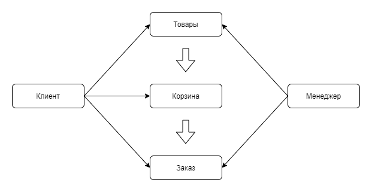
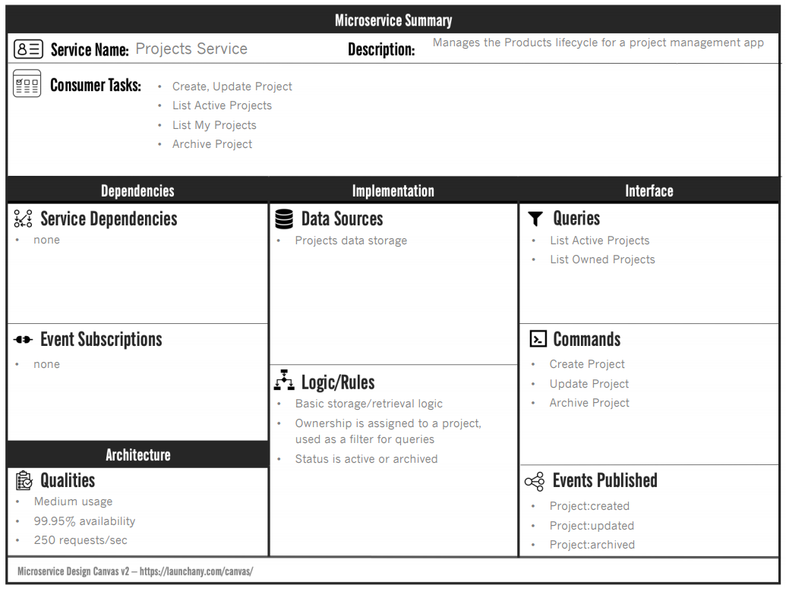

# Деление приложения на микросервисы

## О приложении
Не отличаясь оригинальностью, будем делать интернет магазин.

Покупатели в нем должны иметь возможность искать и просматривать товары. 
Выбранные товары можно добавлять в корзину и затем заказать.

## Пользовательские сценарии
Базовые сценарии в формате 
> Как <роль> я <могу сделать что-то>, чтобы <выгода, польза>

### Поиск товара
Как покупатель я могу ввести строку поиска и получить список товаров, соответствующий поисковому запросу,
чтобы посмотреть товары, которые мне интересны.

### Просмотр информации о товаре
Как покупатель я могу открыть страницу товара, увидеть фото и характеристики товара, 
чтобы лучше понять что именно мне предлагают купить.

### Добавление товара в корзину
Как покупатель я могу добавить выбранный товар в корзину, 
чтобы получить возможность оформить заказ с этим товаром. 

### Просмотр товаров в корзине
Как покупатель я могу посмотреть список товаров в корзине, их количество и стоимость, 
чтобы подготовиться к началу оформления заказа. 

### Оформление заказа
Как покупатель я должен указать имя, email, а также иметь корзину с товарами, 
чтобы выполнить оформление заказа.

### Оплата заказа
Как покупатель, я должен оплатить заказ используя внешнюю платежную систему, 
чтобы завершить процедуру оформления заказа.

### Уведомление о заказе по email
Как покупатель, указавший email, я должен получить уведомление о новом заказе на этот email, 
чтобы убедиться что заказ действительно успешно оформлен. 

### Просмотр всех заказов
Как менеджер, я могу видеть список всех заказов, чтобы управлять ими

### Просмотр информации о заказе
Как менеджер, я могу видеть список товаров заказа и контактные данные покупателя, чтобы понимать
что и кем было заказано

### Отмена заказа
Как менеджер, я могу отменить существующий заказ

### Изменение товара
Как менеджер, я могу изменять данные товара, чтобы актуализировать информацию

### Удаление товара
Как менеджер, я могу удалять товары, чтобы клиенты не могли их заказывать.

## Выделяем сервисы по функциональному признаку

* Клиент
* Товар
* Корзина
* Заказ
* Менеджер

## Схема взаимодействия сервисов

 

## Действия в модели сервисов

### Клиент
**POST /api/client** Добавление клиента

**GET /api/client/{clientId}** Информация о клиенте

### Товар
**GET /api/products/search** Поиск товаров

**GET /api/products/{productId}** Информация о товаре

**POST /api/products** Добавление товара

**POST /api/products/{productId}** Изменение информации о товаре

**DELETE /api/products/{productId}** Удаление товара

### Корзина
**GET /api/cart** Список товаров в корзине

**POST /api/cart** Добавление товара в корзину

**DELETE /api/cart/{cartId}** Удаление товара из корзины

### Заказ
**POST /api/order** Создание заказа

**POST /api/order/pay** Оплата заказа

**GET /api/order** Список заказов

**GET /api/order/{orderId}** Информация о заказе

**POST /api/order/cancel** Отмена заказа

### Менеджер
**POST /api/manager** Добавление менеджера

**POST /api/manager/auth** Проверка авторизационных данных менеджера

**DELETE /api/manager** Удаление менеджера

### Дополнительно

Придуманные до этого момента модели не покрывают сценарий "Уведомление о заказе по email". 
Поэтому для отправки уведомлений добавим еще сервис "Уведомления".

## Описание сервисов

В задании предлагалось заполнить карточки с https://launchany.com/microservice-design-canvas/ 
типа такой:

 

Но заполнять ее в таком виде это неудобно, поэтому будет просто текстом:

### Клиент
**Name:** ClientService

**Consumer tasks:**

Создание клиента, информация о клиенте

**Dependencies:**
\-

**Event subsciptions:** 
\-

**Events published:**

clientCreated

**Data sources:**

База данных для хранения клиентов

**Logic/Rules:**
Добавление клиента, получение информации о клиенте по id

### Товар

**Name:** ProductService

**Consumer tasks:**

Создание товара, поиск товара, информация о товаре

**Dependencies:**
\-

**Event subsciptions:** 
\-

**Events published:**

productAdded

productUpdated

productDeleted 

**Data sources:**

База данных для хранения товаров

**Logic/Rules:**
Добавление товара, поиск товара по названию и характеристикам, получение информации о товаре по id

### Корзина

**Name:** CartService

**Consumer tasks:**

Добавление товара в корзину, удаление из корзины, получение корзины клиента

**Dependencies:**
ProductService

**Event subsciptions:** 
productDeleted, orderCreated

**Events published:**
\-

**Data sources:**

База данных для записей корзины

**Logic/Rules:**
Добавление товара в корзину, удаление из корзины по id, получение корзины клиента.
При получении события productDeleted, удалять записи корзины, связанные с этим товаром.
При получении события orderCreated, удалять записи корзины, связанные с этим заказом.

### Заказ

**Name:** OrderService

**Consumer tasks:**

Создание заказа, получение информации о заказе, оплата заказа, список заказов, удаление заказа

**Dependencies:**
ProductService, ClientService, CartService

**Event subsciptions:** 
\-

**Events published:**
orderCreated, orderPaid

**Data sources:**

База данных для заказов

**Logic/Rules:**
Создание заказа, получение информации о заказе, оплата заказа, список заказов, удаление заказа

### Менеджер

**Name:** ManagerService

**Consumer tasks:**

Создание менеджера, получение информации о менеджере, проверка валидности авторизационных данных менеджера

**Dependencies:**
\-

**Event subsciptions:** 
\-

**Events published:**
\-

**Data sources:**

База данных для хранения менеджеров

**Logic/Rules:**
Создание менеджера, получение информации о менеджере, проверка валидности авторизационных данных менеджера.
Вероятно будет использоваться в Api Gateway.

  
### Уведомления

**Name:** NotificationService

**Consumer tasks:**

Отправка уведомлений

**Dependencies:**
ClientService, OrderService

**Event subsciptions:** 
orderCreated

**Events published:**
\-

**Data sources:**
\-

**Logic/Rules:**
Отправка уведомлений клиенту об успешном создании заказа

